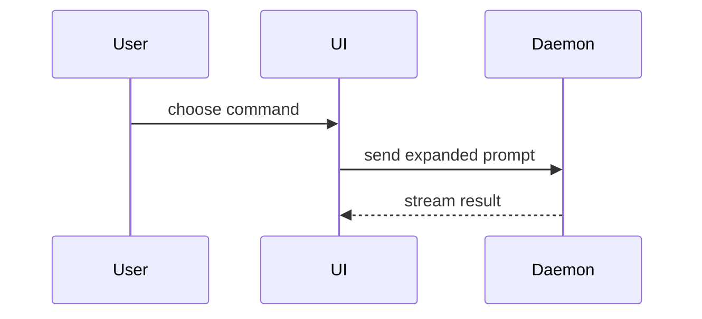

Show the current topic visually. Skip preamble, keep prose brief, pick the smallest view that makes the point.

- Logic or an algorithm as pseudocode:

```text
on(save)
  if content is unchanged
    return cached result
  write new content
  return fresh result
```

- Runtime control flow as a call tree:

```text
submitForm
  createSession
    persistPrompt
    launchAgent
  navigateToSession
```

- File responsibility or a broad refactor as a shallow file tree:

```text
src/
├── commands/       # parses user actions
├── sessions/       # owns session state
└── transport/      # sends API requests
```

- Component interaction or data flow as a Mermaid sequence diagram, written to `show-me.md` in the working directory instead of the chat reply:



- A change to any of the above, as a diff shaped like the view it changes:

```diff
 submitForm
   createSession
     persistPrompt
+    expandSkillMention
     launchAgent
   navigateToSession
+    subscribeToEvents
```

### guidance

Place each visual beside the text it supports; keep only the calls, files, and states the current question needs. Combine views only when one alone can't carry the point.
